<p align="center">
  
</p>

<p align="center"><b>SharpMind. A pure C# / .NET LLM engine — inference and agent tooling in one solution.</b></p>

<p>
  
  
  
</p>

[](https://www.nuget.org/packages/SharpMind.Core)
[](https://github.com/sponsors/Integral2u)
[](https://github.com/Integral2u/SharpMind/commits/master)

---

## What is SharpMind?

SharpMind is an end-to-end LLM stack written entirely in C#, with no dependency on llama.cpp, PyTorch, or any native runtime for its core path. It loads GGUF models, runs quantized CPU/GPU inference with modern decoding acceleration (speculative + Medusa-style drafting), and — unusually for a C# inference engine — also includes its own autograd engine so you can fine-tune (LoRA), distill, and prune models in the same process that serves them.

It ships as a set of composable libraries plus a terminal chat application (`SharpMind.CUI`) built on top of them.

| | |
|---|---|
| **[Live in-browser demo](https://integral2u.github.io/SharpMind/)** | **Chat / conversation view** |
|  |  |
| **Model & session welcome view** | **Runtime options (hardware tier, load mode, sampling)** |
|  |  |

---

## Why SharpMind

- **No native runtime required.** Tensor math, quantization kernels, and the training loop are all managed C#. GPU acceleration (via ILGPU) is opt-in and lives in its own assembly — the CPU path never needs it.
- **Runs models bigger than your RAM.** A disk-streaming load mode pages transformer layers in and out during the forward pass instead of holding the whole model resident (details below).
- **Modern decoding, not just greedy/top-p.** Both classic speculative decoding and Medusa-style multi-head speculative decoding are implemented from scratch, with careful KV-cache rollback on rejection.
- **A genuinely pluggable kernel system.** Hardware-specific kernel variants (scalar/SSE/AVX2/FMA/GPU) are wired up at runtime through a small internal dispatch layer [JigSawDotNet](https://github.com/Integral2u/JigSawDotNet) rather than hand-written `if`/`switch` ladders — adding a new backend means adding an assembly, not editing the core.
- **Agent tooling included.** Tool-calling, permission gating (`Never` / `Ask` / `Always`), and sub-agent orchestration ship in `SharpMind.Inference.Agent`.
- **Inference *and* training in one codebase.** Most C# "LLM" libraries are thin bindings around llama.cpp and only run models. SharpMind can load a GGUF checkpoint, chat with it, or train a model from scratch. LoRA fine-tuning and distillation are also present in the training stack but are still experimental — see [Training](#training-experimental).

---

## Live in-browser demo

**[SharpMind.Live](https://integral2u.github.io/SharpMind/)** is the engine running entirely inside your browser tab — no server, no native runtime, no API call leaving the page. It fetches SmolLM2-135M-Instruct (Q3_K_M) from Hugging Face into the Blazor virtual filesystem, then runs inference through the **AOT-compiled** engine (IL →
WebAssembly via `RunAOTCompilation`, from the same managed C# kernels the desktop CLI uses).

- **Zero backend.** GitHub Pages hosts the static site; the model streams in client-side on first load.
- **Live streaming.** Boot, model load, and every generated token stream to the page as they happen — the decode loop yields to the browser between tokens.
- **What to expect:** GitHub Pages can't set the cross-origin headers WASM threading needs, so the demo runs single-threaded on scalar kernels — roughly 1 token/s on a mid-size laptop. It's the real engine in a tab, not a wrapper.

---

## Install the chat app (Windows)

The quickest way to try the terminal chat client is the installer, which sets up `SharpMind.CUI`, Start Menu + desktop shortcuts, and the app folder:

**[Download SharpMind Console Setup (MSI)](https://github.com/Integral2u/SharpMind/releases/latest/download/SharpMind.Console.Setup.msi)**

Requires the [.NET 10 Runtime](https://dotnet.microsoft.com/download/dotnet/10.0). Running the MSI installs the app and shortcuts; uninstall or repair is available via Apps & Features. Then grab a model as described in [Quick Start](#quick-start-load-and-run-a-model) — the running app also has a built-in model browser.

---
## Quick Start: Load and Run a Model

This walks through the smallest possible program that loads a GGUF model and starts an interactive chat session.

### 1. Get a model

Download a small instruct model to get started — [Qwen3-0.6B-Q8_0](https://huggingface.co/unsloth/Qwen3-0.6B-GGUF) is a good first choice: it's under 1GB, loads quickly, and is known to produce coherent output out of the box.

Place the `.gguf` file in a folder, e.g. `C:\Models\Qwen3-0.6B-Q8_0.gguf`.

### 2. Minimal Program.cs

```csharp
using SharpMind.Core.Quantization;
using SharpMind.Inference;
using SharpMind.Inference.Chat;
using SharpMind.Model;
using SharpMind.Model.Config;
using SharpMind.Model.Format;
using SharpMind.Tokenization;

var modelPath = @"C:\Models\Qwen3-0.6B-Q8_0.gguf";

// 1. Load model metadata, config, and tokenizer from the GGUF file.
var metaHelper = ModelFormatHelpers.GetModelMetaHelperFor(ModelFormat.Gguf);
metaHelper.Load(modelPath, null, out ModelMetaData meta, out ModelConfig modelConfig, out Tokenizer? tokenizer);

if (tokenizer == null)
{
    Console.WriteLine("No tokenizer data found in this GGUF file.");
    return;
}

// 2. Resolve hardware/quant mapping and load the weights.
var sharpConfig = modelConfig.ForModel();
var qOps = QuantizationFactory.Create(sharpConfig.ResolvedHardware);

using var weights = ModelFactory.CreateWeights(modelConfig, sharpConfig, qOps, modelPath, LoadMode.Full);
weights.InitializeWeights();

// 3. Build the transformer.
using var model = ModelFactory.CreateTransformer(weights, sharpConfig);

// 4. Start a chat session.
await using var session = new ChatSession<StandardGeneratorBuilder<KVCacherBuilder>, KVCacherBuilder>(model, tokenizer, meta)
{
    MaxTokens = 512,
    Temperature = 0.7f,
    TopK = 40,
    TopP = 0.9f,
};
session.InitializeChat();

Console.WriteLine("Chat ready! Type a message (or 'exit' to quit).\n");
var cts = new CancellationTokenSource();

await session.StartChatAsync(Prompt, Response, cts.Token);

async Task<ChatMessage> Prompt()
{
    Console.Write("\nYou: ");
    var input = Console.ReadLine() ?? "exit";
    if (input == "exit") cts.Cancel();
    return new ChatMessage { Content = input, Role = ChatRole.User };
}

void Response(ChatStreamEntry entry) => Console.Write(entry.Token);
```

### What each step does

| Step | Purpose |
|---|---|
| `metaHelper.Load` | Reads the GGUF file's architecture, hyperparameters, and tokenizer vocab. Pass `null` for the second argument unless the model ships an external tokenizer file. |
| `modelConfig.ForModel()` | Resolves the config into a hardware-aware mapping (CPU/GPU, quant ops). |
| `ModelFactory.CreateWeights(..., LoadMode.Full)` | Loads and dequantizes all weights into memory up front. Use `LoadMode.Streaming` instead on memory-constrained machines — it loads one layer at a time during inference rather than holding everything resident. |
| `ModelFactory.CreateTransformer` | Wires the loaded weights into the actual forward-pass graph. |
| `ChatSession<...>` | Manages conversation history, prompt formatting (auto-detected from the model's chat template), and the generation loop. |
| `StartChatAsync(Prompt, Response, token)` | Runs the chat loop — `Prompt` supplies the next user message, `Response` receives streamed output tokens as they're generated. |

### Notes

- `Temperature = 0.7f`, `TopK = 40`, `TopP = 0.9f` give more natural, varied output than greedy decoding (`Temperature = 0`). Set `Temperature = 0` for deterministic, reproducible output when debugging.
- `MaxTokens` caps the response length per turn — lower it (e.g. `128`) on slower hardware if you don't need long responses.
- On memory-constrained machines, prefer `LoadMode.Streaming` over `LoadMode.Full`, and stick to Q4–Q8 quantized models under ~1B–3B params for reasonable throughput.

---

## Compatibility matrix

Validated across two independent runs against 15 model/architecture/quantization combinations. "Runs clean" means the model loaded, built a transformer, and completed all five benchmark prompts with no exceptions or crashes — it is **not** a quality claim; output coherence varies a lot by model size and quant level, which is expected and not specific to SharpMind.

| Architecture | Model | Quant | Runs clean (both runs) |
|---|---|---|---|
| Gemma (function-calling variant) | functiongemma-270m-it | Q8_0 | ✅ |
| Gemma 3 | gemma-3-270m-it | Q8_0 | ✅ |
| Gemma 3 | gemma-3-270m-it | Q4_K_M | ✅ |
| SmolLM2 | SmolLM2-135M-Instruct | Q4_K_M | ✅ |
| SmolLM | SmolLM-135M | Q4_K_M | ✅ |
| Qwen2 | Qwen2-0.5B | Q2_K | ✅ |
| Qwen2 (instruct) | qwen2-0.5b-instruct | Q4_K_M | ✅ |
| Qwen2 (instruct) | qwen2-0.5b-instruct | Q8_0 | ✅ |
| Qwen2.5 (instruct) | qwen2.5-1.5b-instruct | Q8_0 | ✅ |
| Qwen3 | Qwen3-0.6B | Q8_0 | ✅ |
| DeepSeek-R1-Distill-Qwen | DeepSeek-R1-Distill-Qwen-1.5B | Q3_K_M | ✅ |
| DeepSeek-R1-Distill-Qwen | DeepSeek-R1-Distill-Qwen-1.5B | Q8_0 | ✅ |
| TinyLlama | tinyllama-1.1b-chat-v1.0 | Q8_0 | ✅ |
| Llama 3 (small) | llama3-small | Q2_K | ✅ |
| Llama 3 (small) | llama3-small | Q3_K_M | ✅ |
| Ministral 3 (sliding window) | Ministral-3-3B-Instruct-2512 | Q4_K_M | ✅ |

_Tested on: **AMD Ryzen 3 2200U (2C/4T, 2.5GHz base) w/ Radeon Vega Mobile Graphics, 12GB RAM** — a modest mobile/laptop-class chip, not a workstation. Load times and throughput scale heavily with hardware and quant level — as a rough sense of range on this machine, `SmolLM-135M.Q4_K_M` loaded in ~2s, while `qwen2.5-1.5b-instruct-q8_0` (the largest model tested) took ~2 minutes to load and initialize. That everything above ran clean on a 2-core/4-thread laptop CPU is itself a reasonable data point for SharpMind's baseline hardware requirements — run your own copy of the benchmark against your target hardware before relying on these numbers for capacity planning._

---

## Extensibility: plugins

Beyond JigSaw's compile-time kernel dispatch, `SharpMind.CUI` has a separate, simpler **runtime plugin loader** for extending the app itself without touching the core libraries. Drop a `.dll` into the app's `Plugins/` folder and `PluginLoader.LoadFrom` will scan it and wire up anything it recognizes:

- **Tools** — any class with a method tagged `[ToolDesc("...")]` (parameters can carry their own `[ToolDesc]` too, for per-argument descriptions) is picked up as an agent tool automatically, the same mechanism the built-in `EchoTool`, `FileSystemTool`, and `WeatherTool` use:

  ```csharp
  public class WeatherTool
  {
      [ToolDesc("Gets the current weather for a specified city.")]
      public async Task<string> GetCurrentWeather([ToolDesc("The name of the city.")] string city) { ... }
  }
  ```

- **Context compactors** — classes implementing `IContextCompactor` register under their own `Name` and become selectable alongside the built-in summarizing/truncating compactors.
- **Prompt pre/post-processors** — `IPromptPreProcessor` / `IPromptPostProcessor` implementations get to rewrite a prompt before it's sent or a completion after it comes back.
- **Generators** — any type implementing `IGeneratorBuilder<TCache>` is discovered by matching the open generic interface via reflection and added to the generator-strategy list next to Standard/Speculative/Medusa — a third-party decoding strategy can appear in the same options menu as the built-in ones.

The loader is defensive by design: each `.dll` loads independently (a failure is recorded as a warning, not a crash), duplicate names are rejected rather than silently overwritten, and only concrete classes with a public parameterless constructor are considered. Today this loader is wired into `SharpMind.CUI` specifically; nothing about the interfaces is CUI-specific, so the same plugin assemblies work if you host the inference/chat libraries directly.

---

### Streaming model loading (`LoadMode.Streaming`)

Normally (`LoadMode.Full`) every transformer layer's weights are allocated and loaded up front. `LoadMode.Streaming` instead:

1. Memory-maps the GGUF file and reads only tensor **metadata** (offsets, shapes, dtypes) at load time — no weight bytes are touched yet.
2. Before each layer runs in the forward pass, `EnsureLayerLoadedSync` blocks (if needed) on that layer's data being read from disk.
3. While the current layer computes, the **next** layer is prefetched on a background task (`PreloadLayerAsync`), overlapping I/O with compute.
4. Once a layer has been consumed, its weights are released (`FreeLayer`) — only the current and next layer's weights are ever resident at once.
5. `CompleteForward` sweeps any remaining resident layers at the end of a pass so memory doesn't creep up across tokens.

The net effect: a model whose full weights don't fit in RAM can still run, trading some throughput for a small, roughly constant memory footprint (current + next layer, rather than all layers). The quantized LM head is also read directly from its raw on-disk bytes in streaming mode rather than materialized as a float tensor, cutting one of the largest single allocations for typical vocab sizes.

---

## Inference deep dive

### Decoding strategies

SharpMind ships three interchangeable generators behind a common `IGenerator<T>` / `IGeneratorBuilder` interface, so switching strategy is a builder call, not a rewrite:

| Generator | Idea | Where |
|---|---|---|
| `StandardGenerator` | Classic one-token-per-forward-pass autoregressive decoding. | `SharpMind.Inference/StandardGenerator.cs` |
| `SpeculativeGenerator<T>` | A small draft model proposes several tokens ahead; the target model verifies them in a single batched forward pass. | `SharpMind.Inference/SpeculativeGenerator.cs` |
| `MedusaGenerator<T>` | K extra "draft heads" attached to one hidden state each predict a token at a future offset; all K+1 candidates are verified in one forward pass — no separate draft model needed. | `SharpMind.Inference/MedusaGenerator.cs` |

**Medusa in more detail**, since it's the more novel of the two: each decoding round, the LM head's own greedy pick becomes `token₀`, and K trained head projections from the *same* hidden state produce `token₁ … token_K`. That draft of length K+1 is run through the model as one batch. Verification then walks the draft left to right — `token₀` is always accepted (it's the model's own choice), and each subsequent token is accepted only if the model's forward pass agrees with the head's guess; the walk stops at the first disagreement. If every token in the draft is accepted, a bonus token is generated for free before the next round starts. On partial acceptance, the KV cache is trimmed back to the last accepted position so generation is bit-for-bit identical to plain greedy decoding — Medusa can only change throughput, never correctness. In the ideal case, with K=3 well-calibrated heads, this gives up to a ~2.5× reduction in forward passes per token; today the heads are randomly initialized and need `MedusaHeads.Calibrate` to be run before that speedup materializes.

Speculative decoding follows the more familiar draft-and-verify pattern with an independent draft model, defaulting to 4 draft tokens per round, and shares the same accept/rollback discipline over the KV cache.

---

### Quantization

Full GGUF-style quant coverage — Q2_K through Q8_0/Q8_1/Q8_K, plus the classic block types (Q4_0/Q4_1/Q5_0/Q5_1) and several 1-bit/ternary formats (IQ1_S, IQ1_M, TQ1_0, TQ2_0) — each with scalar, SSE, AVX2, and FMA kernel variants, and GPU kernels for the most common types.

---

## The "JigSaw" dispatch mechanism

Most inference engines pick a kernel implementation with a big `switch` over CPU features, duplicated at every call site. SharpMind instead defines each swappable operation (a vec-dot, a quantized matmul, an activation, a norm, an optimizer step, …) once as an **abstract method** on a small "ops" class, decorated with a `[PuzzleCornerPiece]` attribute that lists the concrete method for each hardware variant:

```csharp
[PuzzleCornerPiece(QuantizationKeys.KeyVecDotQ4K, true, null,
    "q4k_fma",    $"{NS}.{nameof(QuantizationKernels.VecDotQ4K_FMA)}",
    "q4k_avx2",   $"{NS}.{nameof(QuantizationKernels.VecDotQ4K_AVX2)}",
    "q4k_sse",    $"{NS}.{nameof(QuantizationKernels.VecDotQ4K_Scalar)}",
    "q4k_scalar", $"{NS}.{nameof(QuantizationKernels.VecDotQ4K_Scalar)}")]
public abstract unsafe float VecDotQ4K(float* input, byte* rawWeights, int col, int inFeatures);
```

At startup, a `MappingBuilder` inspects the detected `HardwareTier` (or an explicit override) and the active `SharpMindConfig` (activation, attention, gating, quantization scheme, etc.) and produces a `Dictionary<string,string>` mapping each operation key to the variant name it should use — `"q4k_fma"`, `"gpu"`, and so on. `Assembler.CreateInstance<QuantizationOps>(mapping)` then builds a concrete implementation of the abstract class at runtime, resolving every abstract method straight to its chosen static kernel. The result is cached by a hash of the mapping, so a given hardware/config combination only pays the assembly cost once.

The part that makes this genuinely extensible rather than just "reflection instead of a switch": **other assemblies can contribute additional variants for an existing key without the core project referencing them.** `SharpMind.GPU` declares its own `[PuzzlePeice]` entries against the *same* keys (`KeyVecDotQ4_0`, `KeyQuantizedMatMulQ4K`, …) pointing at ILGPU-backed kernels. JigSaw discovers these via assembly scanning at startup, so calling `WithGpu()` — which just causes `SharpMind.GPU` to be loaded into the process — is enough for GPU variants to become selectable, with no compile-time dependency from `SharpMind.Core` on the GPU project at all. Adding a future Metal, Vulkan, or SIMD-width-specific backend is the same pattern: a new assembly, new `[PuzzlePeice]` entries, zero changes to existing call sites.

---

## Training

This half of SharpMind is functional today but earlier in its lifecycle than inference — expect the fastest churn here.

- **Autograd** (`SharpMind.Training/Autograd`) — a from-scratch gradient engine (`ForwardContext`, `BlockContext`, `Gradients`) underpinning the training loop.
- **Optimizers & schedulers** — including AdamW, gradient norm, and LR scheduling, each also dispatched through the JigSaw mapping system so training kernels get the same hardware-tier treatment as inference kernels.
- **LoRA** (`SharpMind.Training/LoRA`) — low-rank adapters over attention and FFN layers for parameter-efficient fine-tuning.
- **`ModelSizer`** — given a data source, samples it, trains a throwaway tokenizer, and grid-searches architecture hyperparameters under a `SizingBudget`/`SizingConstraints` to recommend a model configuration that fits a target parameter budget — a small AutoML step for "how big a model should I even train on this data."
- **Synthetic data** (`SharpMind.Data/Sources/PseudoLanguage`) — a generated toy-language pipeline (morphemes, vocabulary, configurable complexity) for exercising the tokenizer/training pipeline without needing a real corpus.
- **Data sources** — CSV, JSONL, plain text, HuggingFace `datasets-server` streaming (dependency-free, via `HttpClient` + `System.Text.Json`), and a composable cleaning `Pipeline` with branch/merge nodes.

Expect the training API surface (config records, trainer entry points) to change as this matures.

### Training sample with actual data

`SharpMind.Samples/Training/Acutal/` ships a complete, reproducible end-to-end training run on real text:

| File | Description |
|---|---|
| `shakespeare.txt` | The training corpus — 40,000 lines of Shakespeare's complete works. |
| `shakespeare-job.smmt` | The training job config (GPT-2-style: HiddenDim=384, 6 layers, 6 heads, MaxSeqLen=256, 650 steps, AdamW with warmup). |
| `shakespeare.smm` | The resulting trained checkpoint — a real model you can load and chat with immediately. |

Run `SmmRealTextExample` to reproduce the full pipeline: BPE tokenizer training → data loading → finite-difference training → .SMM export → reload → greedy/sampled/chat inference. The model is deliberately tiny (finite-difference gradients are O(parameters) forwards per step), but it produces recognisably language-like output and exercises every stage of the training-to-inference path.

To load the pre-trained checkpoint directly in the CUI, point it at `shakespeare.smm` or use `SmmTrainingPipeline.LoadForInference` in code. The chat formatter is auto-resolved from the ChatML-style Jinja template embedded in the .SMM file.

### Actual output run to 650 steps
```
You: who dwells there

Delta: Have the heavy haste to thy face should be my fortune.

PETRUCHIO:
What said he will be as we are gone and you?

QUEEN MARGARET:
Thishatefltrerofffrvisoutt,
KING RICHARD ARD:
Though Gire:
Tearry, sat said myondon faseveronown abo.

GRUMIO:

KEEEN MARGARET:
```

---

## IChatClient integration (`Microsoft.Extensions.AI`)

`SharpMind.Extensions.AI` bridges SharpMind into the standard .NET AI ecosystem by wrapping an `IChatSession` behind an `IChatClient`. This means any library that accepts `IChatClient` — semantic-kernel planners, ASP.NET minimal APIs, MAUI apps, or your own code — can use a SharpMind-backed model without knowing anything about GGUF, KV caches, or prompt formatters.

### What it does

| Component | Role |
|---|---|
| `SharpMindChatClient` | `IChatClient` adapter — supports both single-shot (`GetResponseAsync`) and streaming (`GetStreamingResponseAsync`). |
| `ChatMessageConverter` | Bidirectional `ChatMessage` mapping (MEAI ↔ SharpMind) plus `ChatOptions` → `IChatSession` forwarding (temperature, top-k, top-p, max tokens). |
| `AiFunctionToolAdapter` | Routes MEAI `AIFunction` instances into SharpMind's `IAgentBuilder.WithTool` delegate path — MEAI tools run inside SharpMind's agent loop, not as a separate execution path. |

### Quick start

```csharp
using Microsoft.Extensions.AI;
using SharpMind.Core.Quantization;
using SharpMind.Extensions.AI;
using SharpMind.Inference;
using SharpMind.Inference.Agent;
using SharpMind.Inference.Chat;
using SharpMind.Model;
using SharpMind.Model.Config;
using SharpMind.Model.Format;
using SharpMind.Tokenization;

var modelPath = @"C:\Models\Qwen3-0.6B-Q8_0.gguf";

// 1. Load the model (same as the basic Quick Start).
var metaHelper = ModelFormatHelpers.GetModelMetaHelperFor(ModelFormat.Gguf);
metaHelper.Load(modelPath, null, out ModelMetaData meta, out ModelConfig modelConfig, out Tokenizer? tokenizer);
var sharpConfig = modelConfig.ForModel();
var qOps = QuantizationFactory.Create(sharpConfig.ResolvedHardware);
using var weights = ModelFactory.CreateWeights(modelConfig, sharpConfig, qOps, modelPath, LoadMode.Full);
weights.InitializeWeights();
using var model = ModelFactory.CreateTransformer(weights, sharpConfig);

// 2. Create a SharpMind chat session (with optional agent builder for tools).
var agentBuilder = new AgentBuilder("MyAgent");
using IChatSession session = ChatSessionFactory.CreateChatSession(
    typeof(StandardGeneratorBuilder<KVCacherBuilder>),
    typeof(KVCacherBuilder),
    model, tokenizer!, meta,
    agentBuilder: agentBuilder);

// 3. Wrap it in the IChatClient adapter.
await using var client = new SharpMindChatClient(session, agentBuilder);

// 4. Use the standard IChatClient API.
var messages = new List<ChatMessage>
{
    new(ChatRole.System, "You are a helpful assistant."),
    new(ChatRole.User, "What is 2 + 2?"),
};

// Single-shot response.
ChatResponse response = await client.GetResponseAsync(messages);
Console.WriteLine(response.Text);

// Streaming response.
await foreach (ChatResponseUpdate update in client.GetStreamingResponseAsync(messages))
    Console.Write(update.Text);
```

### Using MEAI tools with SharpMind

Tools defined as `AIFunction` instances are automatically routed into SharpMind's agent loop when passed via `ChatOptions.Tools`:

```csharp
using Microsoft.Extensions.AI;

// Define a tool using the MEAI factory.
var getWeather = AIFunctionFactory.Create(
    (string city) => $"72°F and sunny in {city}",
    name: "GetWeather",
    description: "Get the current weather for a city.");

// The adapter registers it with the agent builder on first use.
var response = await client.GetResponseAsync(
    new List<ChatMessage>
    {
        new(ChatRole.User, "What's the weather in London?")
    },
    new ChatOptions { Tools = [getWeather] });

Console.WriteLine(response.Text);
```

The tool executes inside SharpMind's existing tool-loop infrastructure — no separate execution path, no extra dependencies beyond `Microsoft.Extensions.AI.Abstractions`.

### Installation

`SharpMind.Extensions.AI` is a separate project/package. Add it alongside your SharpMind references:

```xml
<ProjectReference Include="..\SharpMind.Extensions.AI\SharpMind.Extensions.AI.csproj" />
```

Or as a NuGet package (once published):

```
dotnet add package SharpMind.Extensions.AI
```

The only additional dependency is `Microsoft.Extensions.AI.Abstractions` — no full `Microsoft.Extensions.AI` or `Microsoft.Extensions.DependencyInjection` required.

---

## OpenAI-compatible HTTP server

`SharpMind.Server` exposes an HTTP API wire-compatible with the OpenAI chat completions spec, so any OpenAI client library (or raw `curl`) can talk to a SharpMind-backed model. It ships as two projects:

| Project | Role |
|---|---|
| `SharpMind.Server` | Class library — `SharpMindService`, `ModelManager`, `SessionFactory`, and the ASP.NET endpoint map. |
| `SharpMind.Server.CLI` | Executable — spawns the service as an orphaned process, provides an interactive REPL, and forwards chat messages over HTTP. |

### Quick start

```
# Start the server with a model directory
sharpmind-server --models C:\Models

# Start and preload a specific model
sharpmind-server --models C:\Models --model Qwen3-0.6B-Q8_0.gguf

# Connect to an already-running service
sharpmind-server
```

The CLI spawns the service process, waits for the health endpoint, then drops into a REPL:

```
you (Qwen3-0.6B-Q8_0.gguf)> Hello!
assistant> Hello! How can I help you today?
you> /models                  # list available models on disk
you> /loaded                  # list models loaded in memory
you> /model SmolLM-135M.Q4_K_M.gguf   # switch model (unloads previous)
you> /unload                  # unload current model from memory
you> /stop                    # shut down the service and exit
```

### CLI flags

| Flag | Description |
|---|---|
| `--models <path>` | Directory containing `.gguf` model files (default: `~/SharpMind/Models`) |
| `--host <host>` | Hostname or IP to bind to (default: `localhost`) |
| `--port <port>` | HTTP port to listen on (default: `11435`) |
| `--model <names>` | Model(s) to preload at startup (comma-separated for multiple) |
| `--stop` | Shut down a running service and exit |
| `--nocli` | Process args, start service, then exit without REPL |
| `--no-files` | Disable file IO for tool calls (read/write only) |
| `--no-network` | Disable network IO for tool calls |
| `-h, --help` | Show help |

### API endpoints

| Method | Path | Description |
|---|---|---|
| `GET` | `/v1/health` | Returns `{"status":"ok"}` when the service is up. |
| `POST` | `/v1/chat/completions` | OpenAI-compatible chat completion (streaming and non-streaming). |
| `GET` | `/v1/models` | List all `.gguf` models found on disk. |
| `GET` | `/v1/models/loaded` | List models currently loaded in memory. |
| `GET` | `/v1/models/{model}` | Get info for a specific model. |
| `POST` | `/v1/models/{model}/load` | Load a model into memory. |
| `DELETE` | `/v1/models/{model}` | Unload a model from memory. |
| `POST` | `/v1/shutdown` | Gracefully stop the service. |

### Example: curl

```bash
# Non-streaming
curl http://localhost:11435/v1/chat/completions \
  -H "Content-Type: application/json" \
  -d '{"model":"Qwen3-0.6B-Q8_0.gguf","messages":[{"role":"user","content":"Hello"}]}'

# Streaming
curl http://localhost:11435/v1/chat/completions \
  -H "Content-Type: application/json" \
  -d '{"model":"Qwen3-0.6B-Q8_0.gguf","messages":[{"role":"user","content":"Hello"}],"stream":true}'
```

### Example: Python (openai library)

```python
from openai import OpenAI

client = OpenAI(base_url="http://localhost:11435/v1", api_key="not-needed")

response = client.chat.completions.create(
    model="Qwen3-0.6B-Q8_0.gguf",
    messages=[{"role": "user", "content": "What is 2+2?"}],
)
print(response.choices[0].message.content)
```

### Architecture notes

- **Lazy loading** — models are loaded on first request (or at startup with `--model`). The `ModelManager` scans the models directory at startup and reports available models immediately; weights are loaded on demand.
- **Ref-counted caching** — each `/v1/chat/completions` request increments the model's ref count; when the response completes, the ref count decrements. Models stay resident until explicitly unloaded (`DELETE /v1/models/{model}`) or the service stops.
- **Session-per-request** — each chat completion creates a fresh `IChatSession`. Conversation history from the `messages` array is replayed via `AddMessage` before generation.
- **Permission gating** — `--no-files` and `--no-network` restrict tool calls at the session level. The flags are forwarded from the CLI to the service process.
- **Streaming** — uses `text/event-stream` (SSE) with the standard `data: {...}` / `data: [DONE]` framing. Prefill progress and other status-only entries are filtered out; only actual token content is streamed to the client.

---

## Also included

- **Agent framework** (`SharpMind.Inference.Agent`) — tool-calling with a three-state permission model (`Never` / `Ask` / `Always`), tool categories, and auto-named sub-agents (temperature → a "Greek tier" naming scheme, e.g. `Athena-Alpha` at low temperature, `Prometheus-Epsilon` at high).
- **Chat layer** (`SharpMind.Inference.Chat`) — pluggable prompt formatters (ChatML, a small Jinja-template evaluator, a simple formatter), pinned-message-aware context compaction (summarizing or truncating), and a `ChatArtifact` concept for attaching text/image/code/JSON blocks to a response.
- **`SharpMind.CUI`** — a full terminal chat client: model browser, session manager, settings, file picker, plugin loading, and a permission gate UI, shown above.
- **`SharpMind.GPU`** — ILGPU-backed kernels for activations, norms, and quantized ops, isolated from the core so the CPU path has zero GPU dependency.
- **`SharpMind.Extensions.AI`** — `IChatClient` adapter for the `Microsoft.Extensions.AI` ecosystem. Wraps any SharpMind `IChatSession` into a standard `IChatClient`, routes MEAI tools through SharpMind's agent loop, and maps chat types bidirectionally — see [IChatClient integration](#ichatclient-integration-microsoftextensionsai).
- **`SharpMind.Extensions.Tools`** — optional common tools (grep, git, datetime) packaged as a plugin DLL. Auto-discovered from the CUI's `plugins/` folder at runtime — no compile-time dependency required. The CUI build copies it there automatically.
- **`SharpMind.Server`** — OpenAI-compatible HTTP server. Serves `/v1/chat/completions` (streaming and non-streaming), `/v1/models`, and related endpoints. Models load lazily, cache with ref-counting, and stay resident until explicitly unloaded. Ships as a class library (`SharpMind.Server`) and a CLI executable (`SharpMind.Server.CLI`) with an interactive REPL, permission gating (`--no-files`, `--no-network`), and multi-model management.
- **`SharpMind.Benchmarks`** — evaluation kernels for measuring model/generator performance.

---

## Project layout

```
SharpMind.Core          Zero-dependency tensor primitives, quantization, activations, memory pooling, MemoryHelpers/BigArray
SharpMind.Model         Architectures, layers, GGUF loading, model config
SharpMind.Inference     Generators (standard/speculative/Medusa), chat, agents, sampling
SharpMind.Training      Autograd, optimizers, LoRA
SharpMind.Tokenization  BPE tokenizer, vocab, serialization
SharpMind.Data          Data sources, cleaning pipeline, batching
SharpMind.Data.Parquet  Parquet data source
SharpMind.GPU           ILGPU-backed GPU kernels (optional)
SharpMind.CUI           Terminal chat application
SharpMind.Extensions.AI Microsoft.Extensions.AI IChatClient adapter
SharpMind.Extensions.Tools Optional common tools (grep, git, datetime) — plugin DLL
SharpMind.Server        OpenAI-compatible HTTP server (class library)
SharpMind.Server.CLI    Server CLI executable + interactive REPL
SharpMind.Samples       Example programs + training sample data (Shakespeare corpus, checkpoint, job config)
SharpMind.Benchmarks    Evaluation harness
SharpMind.Tests         Test suite
SharpMind.Live          Blazor WebAssembly browser demo — AOT-compiled engine, static-hostable on GitHub Pages
```

---

## Status & roadmap

See [CHANGELOG.md](CHANGELOG.md) for release history.

# Wishlist (not ordered)
- [ ] AVX512 Kernels
- [x] Additional Model Support — Ministral-3-3B-Instruct (sliding window attention) now supported
- [ ] Optimizations
- [x] Microsoft IChatClient and or other services. — shipped as `SharpMind.Extensions.AI`
- [x] OpenAI Protocol Server. — shipped as `SharpMind.Server` and `SharpMind.Server.CLI`
- [x] Common tools, GREP, GIT etc — shipped as `SharpMind.Extensions.Tools`
- [x] Limit breaker(Project Goku), int.MaxValue element-count limit workaround. Solutions not excuses. — shipped as `MemoryHelpers`, `BigArray<T>`, `IWorkspace`, `BigWorkspace`

Issues, questions, and early feedback are welcome.

# Notice
<sub>
The SharpMind.Live example in this repository uses SmolLM2-135M-Instruct-Q3_K_M.gguf Hosted on huggingface, a quantized
derivative of HuggingFaceTB/SmolLM2-135M-Instruct
(https://huggingface.co/HuggingFaceTB/SmolLM2-135M-Instruct), GGUF conversion
by Unsloth (https://huggingface.co/unsloth/SmolLM2-135M-Instruct-GGUF).
Licensed under Apache 2.0. See LICENSE-SmolLM2 for the full license text.
</<sub>
